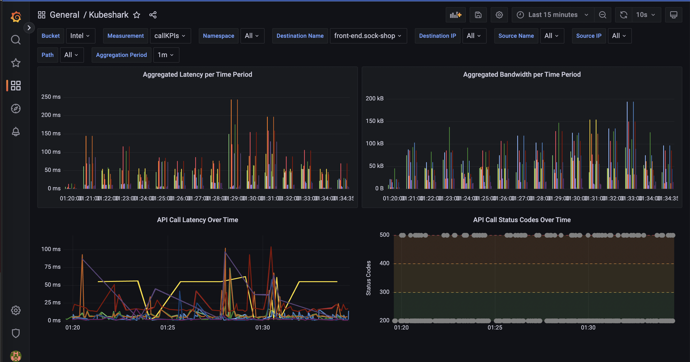

# Telemetry Script Folder

This is the telemetry script folder. Here you can find scripts that can be used to stream metrics and schema-free documents (logs) to your favorite telemetry of log aggregation application.

## Available Scripts

### Stream Metrics to InfluxDB and Visualize in Grafana

- **Script**: [influx_db_kpis.js](./influx_db_kpis.js)
- **Grafana JSON Model**: [Grafana dashboard JSON model](assets/influx_db_kpis_grafana.json)
- **Instructions**: [Adding Dashboard to Grafana](assets/grafana_instructions.md)

#### Description

Stream performance metrics to InfluxDB upon dissection of every HTTP API call. Enjoy the following dashboard in Grafana:
- API call latency and http response code over time (two panels)
- Aggregated latency and bandwidth across a time period (two panels)


### Send Select Traffic Logs to Elasticsearch

- **Script**: [elastic_traffic_logs.js](./elastic_traffic_logs.js)

#### Description

A ready-to-go script that enables you to send select traffic logs to Elasticsearch. REad more about the Elasticsearch integration here.

Change the variables at the top of the script to fit your use-case and put the script in the script folder.

The script uses the [`kfl.match` helper](https://docs.kubeshark.co/en/automation_helpers#kflmatchquery-string-data-object-boolean) in conjunction with a [KFL](https://docs.kubeshark.co/en/filtering) query to identify the select traffic logs. You can play with different KFL queries in the Kubeshark dashboard and define your KFL query:

For example, the following KFL query can be used to filter pod specific ingress/egress GraphQL traffic:
```js
gql and (src.name == "my-pod-name" or dst.name == "my-pod-name")
```

The `vendor.elastic` helper is used to send the traffic logs to an Elasticsearch cloud instance.
